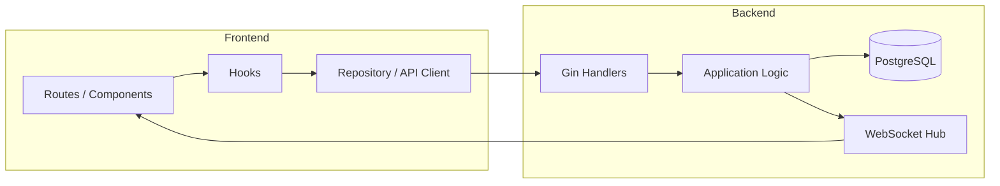

# POSシステム

POS システムのフロントエンド / バックエンド / 共通モジュールを含むリポジトリです。

## 使用技術

- パッケージマネージャー: pnpm
- フロントエンド: React Router
- バックエンド: Go / Gin / GORM
- データベース: PostgreSQL
- リアルタイム通信: WebSocket

## セットアップ

依存パッケージをインストールします。

```bash
pnpm install
```

## コマンド

| コマンド          | 説明                                  |
| ----------------- | ------------------------------------- |
| `pnpm install`    | 依存パッケージのインストール          |
| `pnpm dev`        | 開発環境の立ち上げ                    |
| `pnpm tsc`        | TypeScript の型チェックを実行         |
| `pnpm lint`       | Biome の lint / format チェック       |
| `pnpm fmt`        | Biome による自動整形                  |
| `pnpm test:unit`  | 単体テスト                            |

## 構成

このリポジトリは主に以下の要素で構成されています。

- フロントエンド
  - React Router ベースの画面
  - バックエンド API の呼び出し
  - WebSocket による状態更新の受信

- バックエンド
  - Gin による API サーバー
  - GORM を使った PostgreSQL アクセス
  - WebSocket による更新通知の配信

- 共通モジュール
  - モデル
  - API クライアント
  - repository
  - 変換処理
  - 共通 hook / utility

## Architecture


